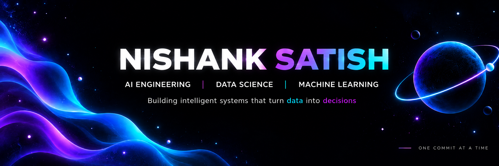
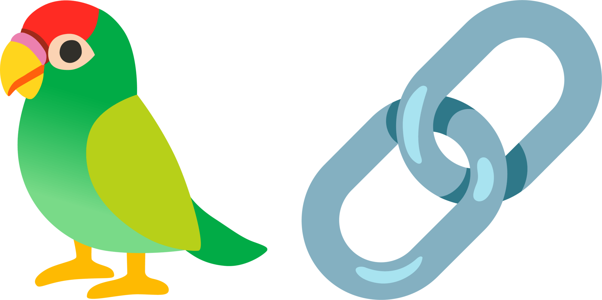
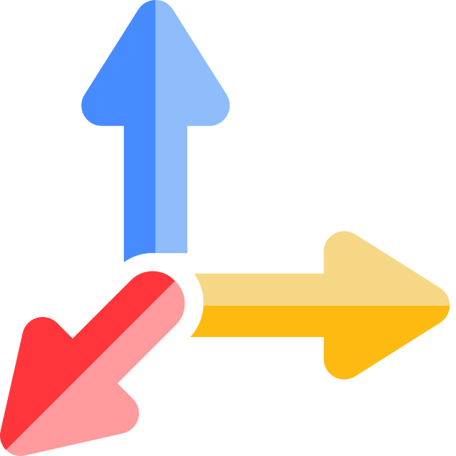
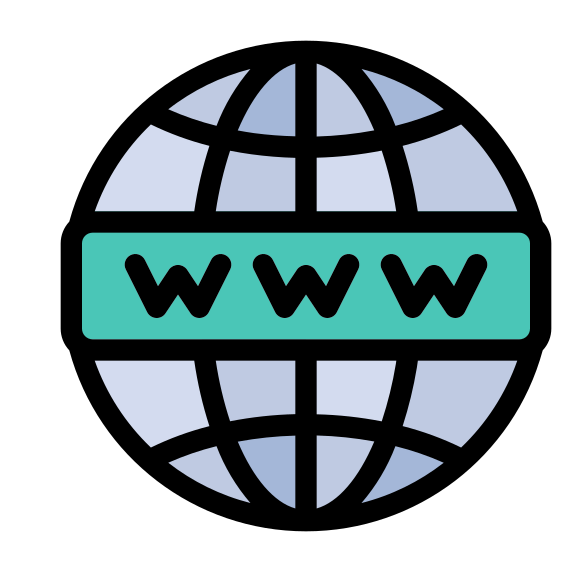
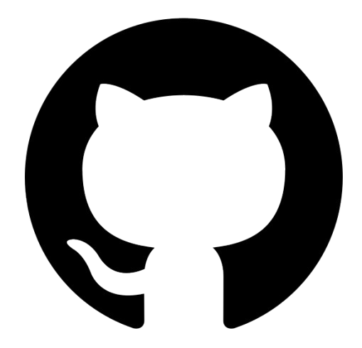

### Hello there 👋

  

## 🧑‍💻 About Me

I’m an AI Engineer and a Data Science graduate student interested in building
intelligent systems that are not only accurate, but useful, measurable, and
reliable in the real world.

- 🎓 **M.Sc. Data Science at TU Braunschweig, Germany**
- 🧠 **B.E. Artificial Intelligence & Machine Learning** from Dayananda Sagar College of Engineering, Bengaluru
- 📄 **3 peer-reviewed publications** across IEEE and Springer venues
- 🏆 **3× hackathon winner**
- 📍 Based in **Braunschweig, Germany**
- 🎯 Open to **AI Engineer, ML Engineer and Data Scientist** opportunities

## 🔭 What I Build

<table border="0" width="100%">
<tr>

<td align="center" width="33%">

### 🤖 LLMs/RAGs and Agentic AI Systems

Multi-hop retrieval, tool calling, 
context expansion, knowledge graphs 
& LLM evaluation.

</td>

<td align="center" width="33%">

### 🧠 Machine Learning and Deep Learning Models

Time-series forecasting, computer vision, 
NLP, remote sensing 
& applied ML.

</td>

<td align="center" width="33%">

### ⚙️ Production AI Systems

FastAPI services, Docker, cloud AI, 
LLM workflows 
& end-to-end ML systems.

</td>

</tr>
</table>

## 🛠️ Tech Stack

### 💻 Languages & Data

  
  &nbsp;&nbsp;&nbsp;
  
  &nbsp;&nbsp;&nbsp;
  

  Python &nbsp;•&nbsp; C++ &nbsp;•&nbsp; SQL

### 🧠 Machine Learning & Deep Learning

  
  &nbsp;&nbsp;&nbsp;
  
  &nbsp;&nbsp;&nbsp;
  
  &nbsp;&nbsp;&nbsp;
  

  PyTorch &nbsp;•&nbsp; TensorFlow &nbsp;•&nbsp; Scikit-learn &nbsp;•&nbsp; OpenCV

### 🤖 LLMs & Agents

  
  &nbsp;&nbsp;&nbsp;
  
  &nbsp;&nbsp;&nbsp;
  

  LangChain &nbsp;•&nbsp; LangGraph &nbsp;•&nbsp; Tavily

  
  
  
  

### ⚙️ Engineering & Infrastructure

  
  &nbsp;&nbsp;&nbsp;
  
  &nbsp;&nbsp;&nbsp;
  
  &nbsp;&nbsp;&nbsp;
  
  &nbsp;&nbsp;&nbsp;
  

  FastAPI &nbsp;•&nbsp; Docker &nbsp;•&nbsp; Azure &nbsp;•&nbsp; Git &nbsp;•&nbsp; Linux

### 🗄️ Vector & Graph Stores

  
  &nbsp;&nbsp;&nbsp;
  

  Neo4j &nbsp;•&nbsp; ChromaDB

## 📌 Featured Projects

<table width="100%" border="0">
<tr>

<td width="50%" valign="top">

<h3 align="center">⚡ AI-Photovoltaic-PV-Assistant</h3>

  
  
  

Bilingual German and English solar advisory assistant combining a
**deterministic calculation engine** with an LLM language layer.

Retrieval is grounded in regulatory and tariff documents, with answers
traced back to their original sources.

  

</td>

<td width="50%" valign="top">

<h3 align="center">🔍 Proofline</h3>

  
  
  

**Fraud detection and audit assistant** designed around source-traceable
evidence, allowing reviewers to connect conclusions directly to supporting
documents.

A deterministic rule core performs detection, while the LLM is confined
to explanation and summarisation.

  

</td>

</tr>

<tr>

<td width="50%" valign="top">

<h3 align="center">💊 PharmAIcist</h3>

  
  
  

Three-stage **Alzheimer's drug discovery pipeline** combining bioactivity
and toxicity prediction, GRU-based reinforcement-learning molecule
generation, and AlphaFold-based interaction modelling.

Achieved **86% prediction accuracy**, **84% SMILES validity**, and
**75% interaction-modelling accuracy**.

  

</td>

<td width="50%" valign="top">

<h3 align="center">🛰️ Remote Sensing Annotation</h3>

  
  
  

**Human-in-the-loop verification layer over YOLOv8** using RemoteCLIP
embeddings, a logistic-regression gate, and a VLM escalation path for
low-confidence detections.

The project documented a significant negative result where synthetic
proposals actively misled real-data evaluation.

  

</td>

</tr>
</table>

## 💼 Experience

### 🏭 Continental AG

**Working Student · AI & Data Solutions (AIDA)**  
📍 Hannover, Germany &nbsp;•&nbsp; `May 2025 → May 2026`

- Built production AI and RAG workflows for industrial analytics and
  raw-material price modelling.
- Developed **FastAPI orchestration services** exposing REST APIs for
  downstream applications.
- Integrated **Azure AI Foundry with web grounding** into LLM workflows.
- Automated analytical workflows, reducing approximately **6 man-weeks**
  of manual analyst effort.
- Optimised inference workflows through prompt chaining and
  model-selection experiments.

### 🚀 Indian Space Research Organisation

**Artificial Intelligence Intern**  
📍 Bengaluru, India &nbsp;•&nbsp; `Feb 2024 → May 2024`

- Built an **LSTM predictive-maintenance system** for an Antenna Control
  Servo System.
- Achieved **MAE ≈ 0.06**.
- Co-authored and presented the resulting research at
  **IEEE SPACE 2024**.

## 📄 Publications

### 📘 Performance Prediction of Antenna Control Servo System based on LSTM Network

IEEE Space, Aerospace and Defence Conference (SPACE 2024) ·
**ISRO & DRDO**

*N. Satish, S. Menon, D. Arora, M. P. Devi, S. Santhalakshmi*

### 📗 Innovating Drug Design for Alzheimer's Disease via Reinforcement Learning for Enhanced Molecular Generation

4th International Conference on Innovations in Computational Intelligence
and Computer Vision · **Springer, Scopus indexed**

*N. Satish, M. Bukapindi, S. Kuntnal, G. Akhil, V. P. Malagi*

### 📙 Optimizing Traffic Management Through Density-Driven Dynamic Traffic Signaling and Emergency Vehicle Prioritization Using Audio and Video

7th International Conference on Innovative Computing and Communication ·
**Springer, Scopus indexed**

*N. Satish, M. Bukapindi, S. Kuntnal, G. Akhil, V. Akash,
S. K. Vasudevan, T. S. Murugesh*

## 📬 Get in Touch

  <i>
    Interested in AI engineering, intelligent systems, retrieval, LLMs and
    applied machine learning? I’m interested in all of these and would love
    to talk or have a conversation.
  </i>

<table align="center" border="0" width="100%">
<tr>

<td align="center" width="25%">
  
   
  <b>Portfolio</b>
</td>

<td align="center" width="25%">
  
   
  <b>LinkedIn</b>
</td>

<td align="center" width="25%">
  
   
  <b>Email</b>
</td>

<td align="center" width="25%">
  
   
  <b>GitHub</b>
</td>

</tr>
</table>

  <b>Made with ❤️ by Nishank</b>

